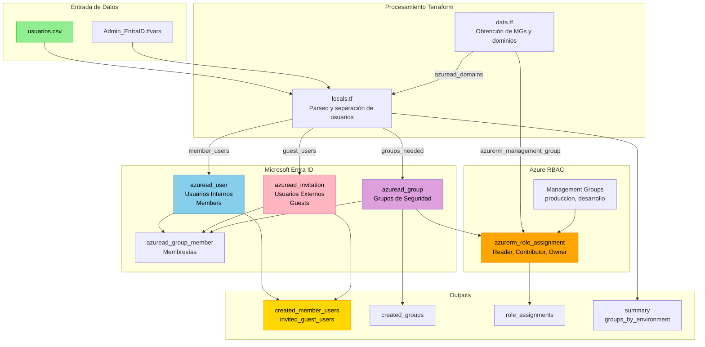
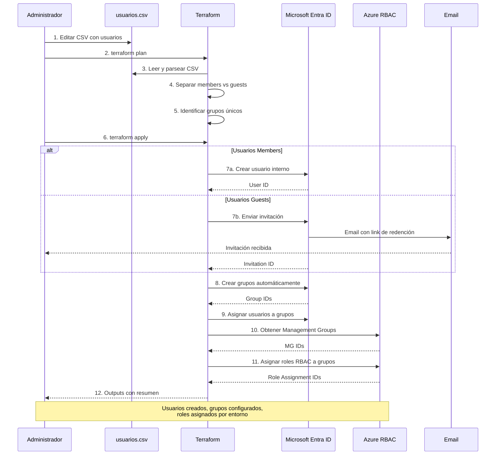

# Automatización de Usuarios y Grupos en Microsoft Entra ID con Terraform

Solución completa en Terraform para automatizar la administración de **Microsoft Entra ID** (anteriormente Azure Active Directory), permitiendo gestionar usuarios, grupos y asignaciones RBAC desde un simple archivo CSV.

## 🎯 Características Principales

✅ **Gestión de usuarios desde CSV**
- Usuarios internos (members) con contraseñas personalizadas
- Usuarios externos (guests) mediante invitaciones
- Perfiles completos con nombre, apellido, departamento, puesto

✅ **Gestión automática de grupos**
- Creación dinámica de grupos desde CSV
- Asignación automática de usuarios a grupos
- Grupos de seguridad habilitados

✅ **Asignaciones RBAC avanzadas**
- Roles a nivel de Management Group
- Mapeo de entornos (producción, desarrollo, etc.)
- Roles configurables por grupo (Reader, Contributor, Owner, etc.)

✅ **Configuración flexible**
- Contraseñas por defecto o personalizadas por usuario
- Ubicación geográfica configurable
- Mensajes personalizados para invitaciones
- Forzar cambio de contraseña en primer login

## 📋 Formato del CSV

El archivo `usuarios.csv` debe tener las siguientes columnas:

| Columna | Requerido | Descripción | Ejemplo |
|---------|-----------|-------------|---------|
| `user_principal_name` | ✅ | Email del usuario | `usuario@empresa.onmicrosoft.com` |
| `nombre_completo` | ✅ | Nombre completo a mostrar | `Juan Pérez García` |
| `nombre` | ❌ | Nombre de pila | `Juan` |
| `apellido` | ❌ | Apellidos | `Pérez García` |
| `departamento` | ❌ | Departamento organizacional | `Tecnología` |
| `puesto` | ❌ | Cargo o posición | `Administrador de Sistemas` |
| `grupo` | ❌ | Nombre del grupo (se crea automáticamente) | `Grupo-Administradores` |
| `password` | ❌ | Contraseña personalizada (solo members) | `MiPassword123!` |
| `habilitado` | ❌ | Estado de la cuenta | `true` o `false` |
| `location` | ❌ | Código ISO del país | `ES`, `US`, `FR` |
| `sku_id` | ❌ | ID de licencia (futuro uso) | - |
| `rol_azure` | ❌ | Rol RBAC de Azure | `Reader`, `Contributor`, `Owner` |
| `tipo_usuario` | ✅ | Tipo de usuario | `member` o `guest` |
| `entorno` | ❌ | Entorno del usuario | `produccion`, `desarrollo` |

### Ejemplo de CSV

```csv
user_principal_name,nombre_completo,nombre,apellido,departamento,puesto,grupo,password,habilitado,location,sku_id,rol_azure,tipo_usuario,entorno
juan.perez@empresa.onmicrosoft.com,Juan Pérez García,Juan,Pérez García,Tecnología,Administrador de Sistemas,Grupo-Administradores,Password123!,true,ES,,Contributor,member,produccion
maria.lopez@empresa.onmicrosoft.com,María López,María,López,Desarrollo,Desarrolladora Senior,Grupo-Desarrollo,,true,ES,,Reader,member,desarrollo
external@gmail.com,Consultor Externo,Consultor,Externo,Consultoría,Consultor,Grupo-Consultores,,true,ES,,Reader,guest,produccion
```

## 🏗️ Arquitectura



## 🔄 Flujo de Trabajo



## 📁 Estructura del Proyecto

```
.
├── provider.tf                  # Configuración de providers (azuread, azurerm)
├── variables.tf                 # Definición de variables de entrada
├── Admin_EntraID.tfvars        # Valores de las variables (ejemplo)
├── usuarios.csv                # Fuente de datos de usuarios
├── main.tf                     # Recursos principales (usuarios, invitaciones, membresías)
├── locals.tf                   # Transformación y parseo de datos CSV
├── data.tf                     # Data sources (dominios, management groups)
├── groups.tf                   # Creación automática de grupos
├── rbac.tf                     # Asignaciones de roles RBAC
├── output.tf                   # Outputs de usuarios, grupos y roles
└── README.md                   # Este archivo
```

## 🚀 Inicio Rápido

### Requisitos Previos

1. **Terraform** >= 1.0
2. **Azure CLI** autenticado con permisos suficientes
3. **Permisos necesarios en Microsoft Entra ID**:
   - User Administrator (para crear usuarios)
   - Groups Administrator (para crear grupos)
   - Guest Inviter (para invitar usuarios externos)
4. **Permisos necesarios en Azure**:
   - Owner o User Access Administrator en los Management Groups donde se asignarán roles

### Paso 1: Clonar el Repositorio

```bash
git clone https://github.com/luisadanmunoz/Admin_EntraID-Create_User_members_-_guests_Groups_RBAC_management_group_CSV.git
cd Admin_EntraID-Create_User_members_-_guests_Groups_RBAC_management_group_CSV
```

### Paso 2: Autenticación en Azure

```bash
# Autenticarse con Azure CLI
az login

# Establecer la suscripción correcta
az account set --subscription "nombre-o-id-de-suscripcion"

# Verificar autenticación
az account show
```

### Paso 3: Preparar el Archivo CSV

Edita `usuarios.csv` con tus usuarios:

```csv
user_principal_name,nombre_completo,nombre,apellido,departamento,puesto,grupo,password,habilitado,location,sku_id,rol_azure,tipo_usuario,entorno
admin@empresa.onmicrosoft.com,Juan Admin,Juan,Admin,IT,Administrador,Admins-Produccion,SecurePass123!,true,ES,,Owner,member,produccion
dev@empresa.onmicrosoft.com,María Dev,María,Dev,Desarrollo,Developer,Devs-Desarrollo,,true,ES,,Contributor,member,desarrollo
consultor@gmail.com,Pedro Consultor,Pedro,Consultor,Externo,Consultor,Consultores,,true,ES,,Reader,guest,produccion
```

### Paso 4: Configurar Variables

Edita `Admin_EntraID.tfvars`:

```hcl
# Contraseña por defecto para usuarios sin password en CSV
default_password = "TuPasswordSegura123!"

# Forzar cambio de contraseña
force_password_change = true

# Ubicación por defecto
default_usage_location = "ES"

# Crear grupos automáticamente
create_groups_if_not_exist = true

# Asignar roles a Management Groups
assign_roles_to_management_group = true

# Management Group por defecto
default_management_group_id = "tu-mg-default"

# Mapeo de entornos a Management Groups
environment_config = {
  produccion = {
    management_group_id = "mg-prod"
  }
  desarrollo = {
    management_group_id = "mg-dev"
  }
  testing = {
    management_group_id = "mg-test"
  }
}
```

### Paso 5: Inicializar Terraform

```bash
terraform init
```

### Paso 6: Planificar los Cambios

```bash
terraform plan -var-file="Admin_EntraID.tfvars"
```

Revisa cuidadosamente el plan para verificar:
- ✅ Usuarios a crear (members y guests)
- ✅ Grupos a crear automáticamente
- ✅ Asignaciones de usuarios a grupos
- ✅ Asignaciones de roles RBAC

### Paso 7: Aplicar los Cambios

```bash
terraform apply -var-file="Admin_EntraID.tfvars"
```

Confirma con `yes` cuando se solicite.

### Paso 8: Revisar los Outputs

Terraform mostrará información importante:

```bash
# Ver resumen general
terraform output summary

# Ver usuarios internos creados
terraform output created_member_users

# Ver usuarios externos invitados
terraform output invited_guest_users

# Ver grupos creados
terraform output created_groups

# Ver asignaciones de roles
terraform output role_assignments

# Ver contraseñas (SENSIBLE)
terraform output -json user_passwords | jq -r
```

## 📊 Variables de Configuración

### Variables Principales

| Variable | Tipo | Descripción | Valor por Defecto |
|----------|------|-------------|-------------------|
| `default_password` | string | Contraseña por defecto para usuarios sin password en CSV | `"Passwordprueba123$"` |
| `force_password_change` | bool | Forzar cambio de contraseña en primer login | `true` |
| `default_usage_location` | string | Código ISO del país por defecto | `"ES"` |
| `create_groups_if_not_exist` | bool | Crear grupos automáticamente desde CSV | `false` |
| `assign_roles_to_management_group` | bool | Asignar roles RBAC a nivel de Management Group | `true` |
| `guest_invitation_message` | string | Mensaje por defecto para invitaciones | `"Has sido invitado..."` |
| `environment_config` | map | Mapeo de entornos a Management Groups | `{}` |
| `default_management_group_id` | string | Management Group por defecto si no se especifica entorno | `""` |

### Ejemplo de Configuración Avanzada

```hcl
# Admin_EntraID.tfvars

# Contraseñas
default_password          = "P@ssw0rd2024!ComplexSecure"
force_password_change     = true

# Localización
default_usage_location    = "ES"

# Grupos
create_groups_if_not_exist = true

# RBAC
assign_roles_to_management_group = true
default_management_group_id      = "mg-default"

# Mensaje personalizado para guests
guest_invitation_message = "Bienvenido a la organización. Por favor, redime esta invitación para acceder a los recursos compartidos."

# Mapeo completo de entornos
environment_config = {
  produccion = {
    management_group_id = "mg-prod-001"
  }
  preproduccion = {
    management_group_id = "mg-preprod-001"
  }
  desarrollo = {
    management_group_id = "mg-dev-001"
  }
  testing = {
    management_group_id = "mg-test-001"
  }
  sandbox = {
    management_group_id = "mg-sandbox-001"
  }
}
```

## 🔐 Seguridad y Mejores Prácticas

### 1. Gestión de Contraseñas

**❌ NO HAGAS ESTO:**
```hcl
# Contraseña hardcodeada en el código
default_password = "Password123!"
```

**✅ HAZ ESTO:**
```bash
# Usar variables de entorno
export TF_VAR_default_password="$(openssl rand -base64 32)"

# O usar Azure Key Vault
data "azurerm_key_vault_secret" "default_password" {
  name         = "default-user-password"
  key_vault_id = data.azurerm_key_vault.main.id
}
```

### 2. Almacenamiento del State

**Configurar backend remoto en Azure Storage:**

```hcl
# backend.tf
terraform {
  backend "azurerm" {
    resource_group_name  = "rg-terraform-state"
    storage_account_name = "sttfstate"
    container_name       = "tfstate"
    key                  = "entraid-admin.tfstate"
  }
}
```

### 3. Protección de Outputs Sensibles

```bash
# Las contraseñas están marcadas como sensitive
# Para verlas de forma segura:
terraform output -json user_passwords > passwords.json

# Guardar en un lugar seguro y eliminar el archivo
# Alternativamente, enviarlas a un Key Vault
```

### 4. Auditoría y Logging

```bash
# Habilitar logging detallado
export TF_LOG=DEBUG
export TF_LOG_PATH=./terraform.log

# Revisar cambios antes de aplicar
terraform plan -out=tfplan
terraform show tfplan

# Guardar el plan para auditoría
terraform show -json tfplan > plan.json
```

### 5. Principio de Mínimo Privilegio

- ✅ Asigna solo los roles necesarios (Reader por defecto)
- ✅ Usa entornos separados con diferentes Management Groups
- ✅ Revisa periódicamente las asignaciones de roles
- ✅ Elimina usuarios inactivos regularmente

## 📈 Casos de Uso Avanzados

### Caso 1: Onboarding Masivo de Empleados

**Escenario**: 50 nuevos empleados ingresando en diferentes departamentos.

```csv
user_principal_name,nombre_completo,nombre,apellido,departamento,puesto,grupo,password,habilitado,location,sku_id,rol_azure,tipo_usuario,entorno
empleado01@empresa.com,Empleado Uno,Empleado,Uno,IT,Junior Dev,Developers,,true,ES,,Reader,member,desarrollo
empleado02@empresa.com,Empleado Dos,Empleado,Dos,IT,Junior Dev,Developers,,true,ES,,Reader,member,desarrollo
empleado03@empresa.com,Empleado Tres,Empleado,Tres,Marketing,Specialist,Marketing,,true,ES,,Reader,member,produccion
...
```

**Ventajas:**
- ⚡ Creación de 50 usuarios en minutos
- 🔄 Grupos asignados automáticamente
- 🔐 Permisos RBAC configurados por departamento
- 📧 Contraseñas temporales generadas

### Caso 2: Colaboradores Externos Temporales

**Escenario**: Consultores externos con acceso limitado a recursos específicos.

```csv
user_principal_name,nombre_completo,nombre,apellido,departamento,puesto,grupo,password,habilitado,location,sku_id,rol_azure,tipo_usuario,entorno
consultor1@external.com,Juan Consultor,Juan,Consultor,Consultoría,Senior Consultant,Consultores-Externos,,true,ES,,Reader,guest,produccion
consultor2@external.com,María Asesora,María,Asesora,Consultoría,Tech Advisor,Consultores-Externos,,true,US,,Reader,guest,produccion
```

**Configuración en tfvars:**
```hcl
guest_invitation_message = "Has sido invitado como consultor externo. Tu acceso es temporal y limitado a recursos específicos del proyecto."

environment_config = {
  produccion = {
    management_group_id = "mg-prod-limited"
  }
}
```

### Caso 3: Estructura Organizacional Compleja

**Escenario**: Múltiples departamentos con diferentes niveles de acceso.

```csv
user_principal_name,nombre_completo,nombre,apellido,departamento,puesto,grupo,password,habilitado,location,sku_id,rol_azure,tipo_usuario,entorno
cto@empresa.com,CTO Principal,CTO,Principal,Dirección,CTO,IT-Leadership,SecurePass1!,true,ES,,Owner,member,produccion
arquitecto@empresa.com,Arquitecto Senior,Arquitecto,Senior,Arquitectura,Architect,Arquitectos,SecurePass2!,true,ES,,Contributor,member,produccion
dev-senior@empresa.com,Dev Senior,Dev,Senior,Desarrollo,Senior Developer,Developers-Senior,,true,ES,,Contributor,member,desarrollo
dev-junior@empresa.com,Dev Junior,Dev,Junior,Desarrollo,Junior Developer,Developers-Junior,,true,ES,,Reader,member,desarrollo
```

**Jerarquía de permisos:**
- 👔 **IT-Leadership** → Owner en producción
- 🏗️ **Arquitectos** → Contributor en producción
- 💻 **Developers-Senior** → Contributor en desarrollo
- 🎓 **Developers-Junior** → Reader en desarrollo

### Caso 4: Múltiples Entornos con Separación Estricta

```hcl
# Admin_EntraID.tfvars
environment_config = {
  produccion = {
    management_group_id = "mg-prod"
  }
  preproduccion = {
    management_group_id = "mg-preprod"
  }
  desarrollo = {
    management_group_id = "mg-dev"
  }
  testing = {
    management_group_id = "mg-test"
  }
  sandbox = {
    management_group_id = "mg-sandbox"
  }
}
```

## 🔄 Operaciones Comunes

### Añadir Nuevos Usuarios

1. Editar `usuarios.csv` y añadir las nuevas líneas
2. Ejecutar `terraform plan` para revisar
3. Ejecutar `terraform apply` para crear

### Modificar Usuarios Existentes

**⚠️ IMPORTANTE**: Terraform NO actualiza usuarios existentes. Para modificar:

1. Opción A: Eliminar del CSV, ejecutar `terraform apply`, volver a añadir con nuevos datos
2. Opción B: Modificar manualmente en el portal de Azure
3. Opción C: Usar `terraform import` para usuarios ya existentes

### Eliminar Usuarios

1. Eliminar la línea del usuario del CSV
2. Ejecutar `terraform plan` (verá `- destroy`)
3. Ejecutar `terraform apply` para eliminar

**⚠️ CUIDADO**: Esto eliminará permanentemente el usuario de Entra ID.

### Deshabilitar Usuarios Temporalmente

Cambiar el campo `habilitado` a `false` en el CSV:

```csv
usuario@empresa.com,Usuario Prueba,Usuario,Prueba,IT,Dev,Grupo1,,false,ES,,Reader,member,desarrollo
```

### Cambiar Asignaciones de Grupo

Simplemente cambiar el valor de la columna `grupo` en el CSV y aplicar.

### Reasignar Roles RBAC

Cambiar el valor de `rol_azure` y/o `entorno` en el CSV:

```csv
# Antes: Reader en desarrollo
usuario@empresa.com,Usuario,Usuario,Apellido,IT,Dev,Developers,,true,ES,,Reader,member,desarrollo

# Después: Contributor en producción
usuario@empresa.com,Usuario,Usuario,Apellido,IT,Dev,Developers,,true,ES,,Contributor,member,produccion
```

## 🐛 Troubleshooting

### Error: "Insufficient privileges"

**Problema**: El service principal no tiene permisos suficientes.

**Solución**:
```bash
# Verificar roles actuales
az role assignment list --assignee <service-principal-id>

# Asignar roles necesarios
az role assignment create \
  --assignee <service-principal-id> \
  --role "User Administrator" \
  --scope "/providers/Microsoft.Management/managementGroups/<mg-id>"
```

### Error: "The domain is not verified"

**Problema**: El dominio del tenant no está verificado.

**Solución**:
```bash
# Listar dominios
az ad domain list

# Usar un dominio verificado en el CSV
# Por ejemplo: usuario@empresa.onmicrosoft.com
```

### Error: "User already exists"

**Problema**: El usuario ya existe en Entra ID.

**Solución A - Importar el usuario existente**:
```bash
# Obtener el Object ID del usuario
USER_ID=$(az ad user show --id usuario@empresa.com --query id -o tsv)

# Importar a Terraform
terraform import 'azuread_user.member_users["usuario@empresa.com"]' $USER_ID
```

**Solución B - Eliminar del estado de Terraform**:
```bash
terraform state rm 'azuread_user.member_users["usuario@empresa.com"]'
```

### Error: "Management Group not found"

**Problema**: El Management Group especificado no existe o no es accesible.

**Solución**:
```bash
# Listar Management Groups disponibles
az account management-group list --query "[].{Name:name, DisplayName:displayName}"

# Verificar acceso
az account management-group show --name <mg-name>

# Actualizar el tfvars con el nombre correcto
```

### Error: CSV con caracteres especiales

**Problema**: El CSV contiene caracteres especiales que causan errores de parseo.

**Solución**:
```bash
# Asegurar que el CSV esté en UTF-8
file -I usuarios.csv

# Convertir si es necesario
iconv -f ISO-8859-1 -t UTF-8 usuarios.csv > usuarios_utf8.csv
```

### Usuarios Guest no reciben invitaciones

**Problema**: Los emails de invitación no llegan.

**Verificar**:
1. ✅ El email está correcto en el CSV
2. ✅ El dominio no está bloqueado en las políticas de Entra ID
3. ✅ Revisar carpeta de spam
4. ✅ Verificar en el portal que la invitación se creó:
```bash
az ad user list --filter "userType eq 'Guest'" --query "[].{UPN:userPrincipalName, Mail:mail, Status:accountEnabled}"
```

## 📊 Outputs Disponibles

### 1. created_member_users

Lista de usuarios internos creados con sus detalles:

```bash
terraform output created_member_users
```

Ejemplo de output:
```json
{
  "usuario@empresa.com": {
    "object_id": "12345678-1234-1234-1234-123456789012",
    "display_name": "Usuario Prueba",
    "user_principal_name": "usuario@empresa.com",
    "department": "IT",
    "user_type": "Member"
  }
}
```

### 2. invited_guest_users

Lista de usuarios externos invitados:

```bash
terraform output invited_guest_users
```

Ejemplo de output:
```json
{
  "externo@gmail.com": {
    "user_id": "87654321-4321-4321-4321-210987654321",
    "user_email_address": "externo@gmail.com",
    "redeem_url": "https://login.microsoftonline.com/redeem?rd=...",
    "user_type": "Guest",
    "display_name": "Usuario Externo"
  }
}
```

### 3. created_groups

Grupos creados automáticamente:

```bash
terraform output created_groups
```

### 4. role_assignments

Asignaciones de roles RBAC por grupo y entorno:

```bash
terraform output role_assignments
```

Ejemplo de output:
```json
{
  "Developers": {
    "group_name": "Developers",
    "role": "Contributor",
    "entorno": "desarrollo",
    "management_group_id": "mg-dev",
    "management_group_name": "Development Environment",
    "scope": "/providers/Microsoft.Management/managementGroups/mg-dev"
  }
}
```

### 5. summary

Resumen general de la operación:

```bash
terraform output summary
```

Ejemplo de output:
```json
{
  "total_member_users_created": 15,
  "total_guest_users_invited": 3,
  "total_groups_created": 5,
  "domain": "empresa.onmicrosoft.com"
}
```

### 6. groups_by_environment

Grupos organizados por entorno:

```bash
terraform output groups_by_environment
```

### 7. groups_without_mg

Grupos sin Management Group configurado (para auditoría):

```bash
terraform output groups_without_mg
```

## 🔄 Integración con CI/CD

### GitHub Actions

```yaml
name: Deploy Entra ID Users

on:
  push:
    branches: [main]
    paths:
      - 'usuarios.csv'
      - '*.tf'

jobs:
  terraform:
    runs-on: ubuntu-latest
    steps:
      - uses: actions/checkout@v3
      
      - name: Setup Terraform
        uses: hashicorp/setup-terraform@v2
        
      - name: Azure Login
        uses: azure/login@v1
        with:
          creds: ${{ secrets.AZURE_CREDENTIALS }}
      
      - name: Terraform Init
        run: terraform init
        
      - name: Terraform Plan
        run: terraform plan -var-file="Admin_EntraID.tfvars"
        
      - name: Terraform Apply
        if: github.ref == 'refs/heads/main'
        run: terraform apply -auto-approve -var-file="Admin_EntraID.tfvars"
```

### Azure DevOps Pipeline

```yaml
trigger:
  branches:
    include:
      - main
  paths:
    include:
      - usuarios.csv
      - '*.tf'

pool:
  vmImage: 'ubuntu-latest'

steps:
- task: TerraformInstaller@0
  inputs:
    terraformVersion: 'latest'

- task: AzureCLI@2
  displayName: 'Terraform Init'
  inputs:
    azureSubscription: 'Azure-ServiceConnection'
    scriptType: 'bash'
    scriptLocation: 'inlineScript'
    inlineScript: |
      terraform init

- task: AzureCLI@2
  displayName: 'Terraform Plan'
  inputs:
    azureSubscription: 'Azure-ServiceConnection'
    scriptType: 'bash'
    scriptLocation: 'inlineScript'
    inlineScript: |
      terraform plan -var-file="Admin_EntraID.tfvars" -out=tfplan

- task: AzureCLI@2
  displayName: 'Terraform Apply'
  condition: and(succeeded(), eq(variables['Build.SourceBranch'], 'refs/heads/main'))
  inputs:
    azureSubscription: 'Azure-ServiceConnection'
    scriptType: 'bash'
    scriptLocation: 'inlineScript'
    inlineScript: |
      terraform apply -auto-approve tfplan
```

## 📚 Recursos Adicionales

- [Documentación de Microsoft Entra ID](https://learn.microsoft.com/en-us/entra/fundamentals/)
- [Terraform AzureAD Provider](https://registry.terraform.io/providers/hashicorp/azuread/latest/docs)
- [Terraform AzureRM Provider](https://registry.terraform.io/providers/hashicorp/azurerm/latest/docs)
- [Azure Management Groups](https://learn.microsoft.com/en-us/azure/governance/management-groups/overview)
- [Azure RBAC Best Practices](https://learn.microsoft.com/en-us/azure/role-based-access-control/best-practices)

## 🤝 Contribución

Las contribuciones son bienvenidas. Por favor:

1. Haz fork del repositorio
2. Crea una rama para tu feature (`git checkout -b feature/nueva-funcionalidad`)
3. Commitea tus cambios (`git commit -am 'Añadir nueva funcionalidad'`)
4. Push a la rama (`git push origin feature/nueva-funcionalidad`)
5. Crea un Pull Request

## 📝 Licencia

Este proyecto está bajo la licencia MIT. Ver el archivo `LICENSE` para más detalles.

## 👤 Autor

**Luis Adán Muñoz**
- GitHub: [@luisadanmunoz](https://github.com/luisadanmunoz)
- LinkedIn: [Luis Adán Muñoz](https://www.linkedin.com/in/luisadanmunoz/)

## ⚠️ Disclaimer

Este proyecto es una herramienta de automatización que modifica usuarios y permisos en Microsoft Entra ID y Azure. Úsalo con precaución:

- ✅ Prueba primero en un entorno de desarrollo
- ✅ Revisa cuidadosamente el plan de Terraform antes de aplicar
- ✅ Mantén backups de tu configuración
- ✅ Documenta todos los cambios realizados
- ⚠️ Los cambios en producción pueden afectar el acceso de usuarios reales

## 🙏 Agradecimientos

- Comunidad de Terraform
- Documentación oficial de Microsoft
- Contribuidores del proyecto

---

**⭐ Si este proyecto te resulta útil, considera darle una estrella en GitHub**
